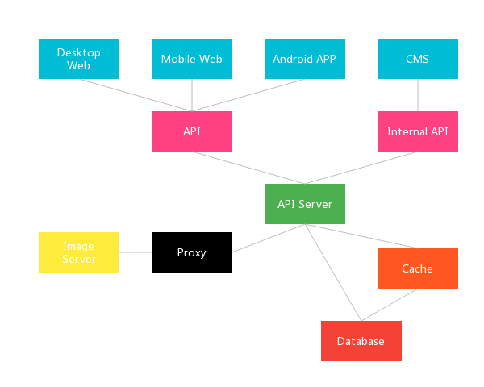

# youbo-docs


> Yet another pure and fresh micro blog.

A docs for youbo.

**Note**: In order to get better reading experience, you can install
- [markdown-preview-enhanced](https://github.com/shd101wyy/markdown-preview-enhanced)
- [Graphviz](http://www.graphviz.org/)

## Architecture



```viz
graph youbo {
     Desktop_Web -- API
     Mobile_Web -- API
     Android_APP -- API
     CMS -- Internal_API
     API -- API_Server
     Internal_API -- API_Server
     API_Server -- Image_Server
     API_Server -- Cache
     API_Server -- Database
     Cache -- Database
}
```

## Category

symbol | type | core tech
------ | ---- | ---------
[Iris](https://github.com/happylrd/youbo-api)       | API Server  | Spring
[Seria](https://github.com/happylrd/youbo-desktop)  | Desktop Web | Vue
[Metis](https://github.com/happylrd/youbo-mobile)   | Mobile Web  | Vue
[Daphne](https://github.com/happylrd/youbo-android) | Android APP | Android
[kiri](https://github.com/happylrd/youbo-cms)       | CMS         | React

> Note: some repos are private now.

## UI design

> ui design language: material design

Type                 | Value    | Effect
----                 | -----    | ------
Dark Primary Color   | #0097A7  | <div style="width:30px;height:30px;border-radius:50%;background-color:#0097A7"></div>
Primary Color        | #00BCD4  | <div style="width:30px;height:30px;border-radius:50%;background-color:#00BCD4"></div>
Light Primary Color  | #B2EBF2  | <div style="width:30px;height:30px;border-radius:50%;background-color:#B2EBF2"></div>
Text/Icons           | #FFFFFF  | <div style="width:30px;height:30px;border-radius:50%;background-color:#FFFFFF"></div>
Accent Color         | #FF4081  | <div style="width:30px;height:30px;border-radius:50%;background-color:#FF4081"></div>
Primary Text         | #212121  | <div style="width:30px;height:30px;border-radius:50%;background-color:#212121"></div>
Secondary Text       | #757575  | <div style="width:30px;height:30px;border-radius:50%;background-color:#757575"></div>
Divider Color        | #BDBDBD  | <div style="width:30px;height:30px;border-radius:50%;background-color:#BDBDBD"></div>


## Business

### Domain model

#### Relationship

```puml
User "1" -- "*" UserFollow : following
User "1" -- "*" UserFollow : followed

User "1" -- "*" Org : create

OrgMember "*" -- "1" User : can_be

Org "1" -- "*" OrgMember : has

User "*" -- "*" Role
(User, Role) . UserRole

User "1" -- "*" Tweet : publish

Tweet "1" -- "*" TweetFragment : has

User "1" -- "*" Comment : publish
Tweet "1" -- "*" Comment : has

User "1" -- "*" Collection : has
Tweet "1" -- "*" Collection : has

User "1" -- "*" Favorite : has
Tweet "1" -- "*" Favorite : has
```

#### Structure

##### User

Field       | Type                              | Desc
-----       | ----                              | ----
id          | bigint auto_increment primary key | id
username    | varchar(128) not null unique      | 用户名
password    | varchar(255) not null             | 密码
email       | varchar(64) null                  | 邮箱地址
phone       | varchar(64) null                  | 手机号
nickname    | varchar(255) null                 | 昵称
realname    | varchar(255) null                 | 真实姓名
avatar      | varchar(255) null                 | 头像
gender      | int not null                      | 性别
birthday    | date null                         | 生日
description | varchar(255) null                 | 描述
enabled     | int not null                      | 是否激活
createAt    | datetime not null                 | 创建时间
updateAt    | datetime not null                 | 更新时间

##### UserFollow

Field       | Type                              | Desc
-----       | ----                              | ----
id          | bigint auto_increment primary key | id
createAt    | datetime not null                 | 创建时间
updateAt    | datetime not null                 | 更新时间
originId    | bigint null fk                    | 粉丝
targetId    | bigint null fk                    | 被关注者

##### Role

Field       | Type                              | Desc
-----       | ----                              | ----
id          | bigint auto_increment primary key | id
createAt    | datetime not null                 | 创建时间
updateAt    | datetime not null                 | 更新时间
name        | varchar(255) null                 | 角色名

##### UserRole

Field       | Type                              | Desc
-----       | ----                              | ----
user_id     | bigint not null {{1/2 pk}}        | 用户id
role_id     | bigint not null {{1/2 pk}}        | 角色id

##### Org

Field       | Type                              | Desc
-----       | ----                              | ----
id          | bigint auto_increment primary key | id
name        | varchar(255) not null             | 组织名
description | varchar(255) not null             | 组织描述
picture     | varchar(255) not null             | 组织图片
createAt    | datetime not null                 | 创建时间
updateAt    | datetime not null                 | 更新时间
ownerId     | bigint null fk                    | 组织创建者id

##### OrgMember

Field       | Type                              | Desc
-----       | ----                              | ----
id          | bigint auto_increment primary key | id
role        | int not null                      | 组织成员角色
createAt    | datetime not null                 | 创建时间
updateAt    | datetime not null                 | 更新时间
userId      | bigint null fk                    | 用户id
orgId       | bigint null fk                    | 组织id

##### Tweet

Field       | Type                              | Desc
-----       | ----                              | ----
id          | bigint auto_increment primary key | id
createAt    | datetime not null                 | 创建时间
updateAt    | datetime not null                 | 更新时间
userId      | bigint null fk                    | 用户id

##### TweetFragment

Field       | Type                              | Desc
-----       | ----                              | ----
id          | bigint auto_increment primary key | id
type        | int not null                      | 类型
content     | varchar(255) not null             | 内容
createAt    | datetime not null                 | 创建时间
updateAt    | datetime not null                 | 更新时间
tweetId     | bigint null fk                    | 推文id

##### Comment

Field       | Type                              | Desc
-----       | ----                              | ----
id          | bigint auto_increment primary key | id
content     | varchar(255) not null             | 内容
createAt    | datetime not null                 | 创建时间
updateAt    | datetime not null                 | 更新时间
userId      | bigint null fk                    | 用户id
tweetId     | bigint null fk                    | 推文id

##### Collection

Field       | Type                              | Desc
-----       | ----                              | ----
id          | bigint auto_increment primary key | id
enabled     | bit not null                      | 用于删除
createAt    | datetime not null                 | 创建时间
updateAt    | datetime not null                 | 更新时间
userId      | bigint null fk                    | 用户id
tweetId     | bigint null fk                    | 推文id

##### Favorite

Field       | Type                              | Desc
-----       | ----                              | ----
id          | bigint auto_increment primary key | id
enabled     | bit not null                      | 用于删除
createAt    | datetime not null                 | 创建时间
updateAt    | datetime not null                 | 更新时间
userId      | bigint null fk                    | 用户id
tweetId     | bigint null fk                    | 推文id
